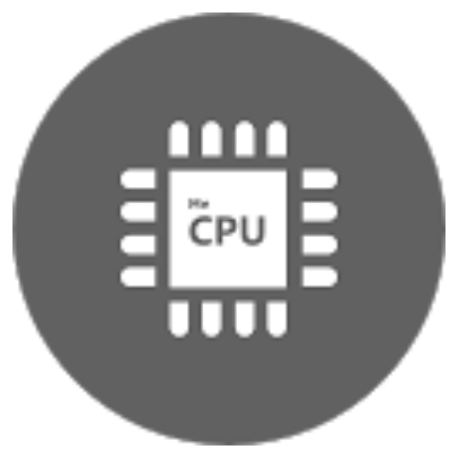
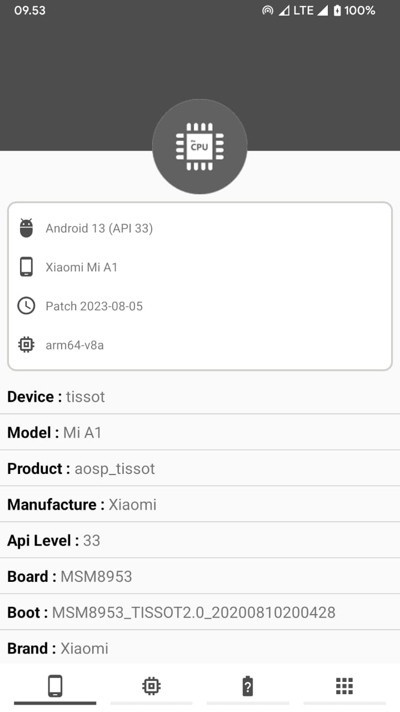
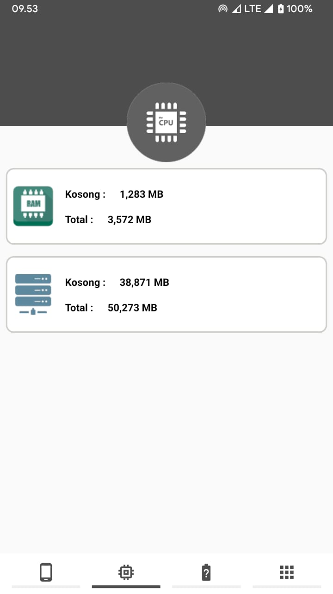
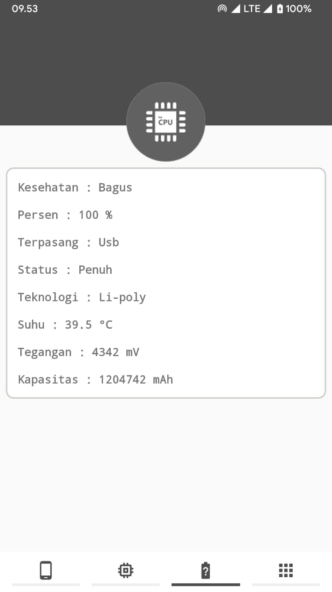
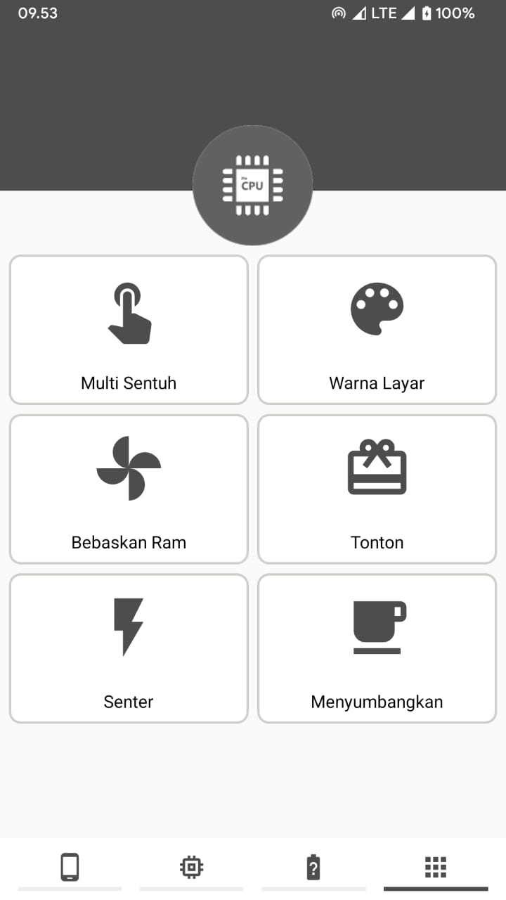
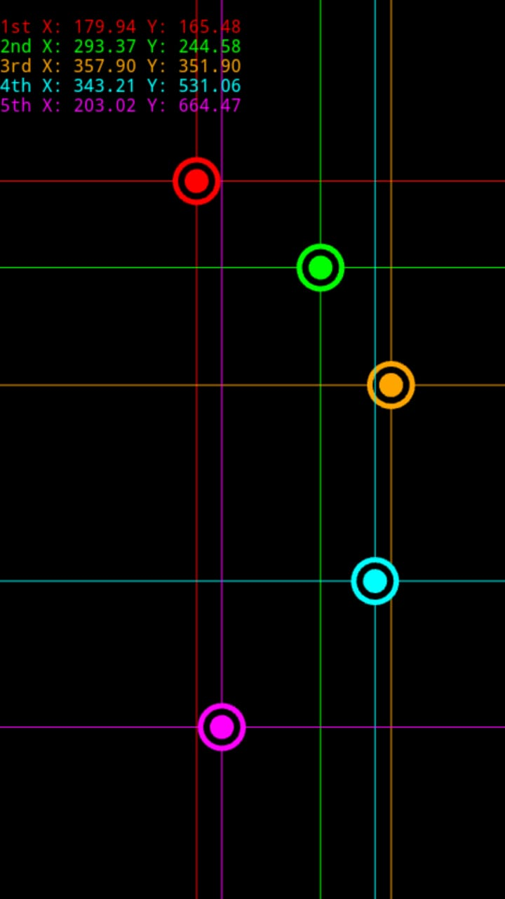
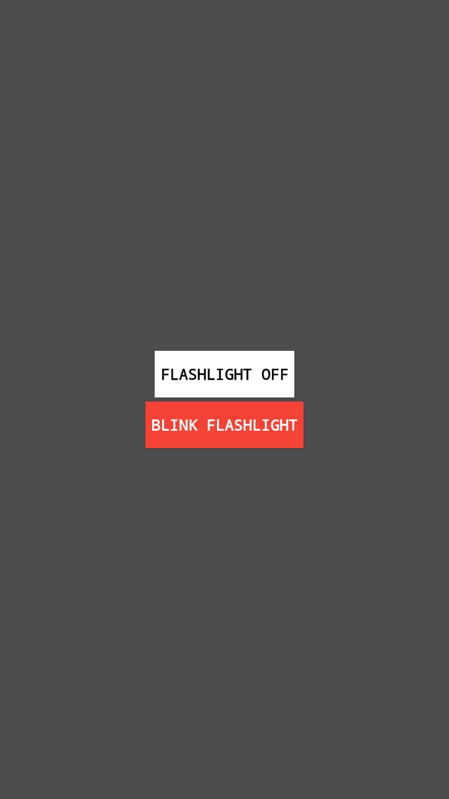

# Me Device Test
Me Device Test atau jika di artikan dalam bahasa indonesia ialah Test Perangkat Saya adalah sebuah aplikasi untuk sebuah informasi dari perangkat anda. aplikasi ini sangat cocok untuk anda yang ingin membeli handphone baru/bekas terlihat baru tanpa terkecoh dengan ucapan manis sang penjual, buktikan dengan menggunakan aplikasi Me Device Test.

# Hastag
[#medevicetest](https://cusmedroid.github.io/Me-Device-Test) [#me-device-test](https://cusmedroid.github.io/Me-Device-Test) [#phonetest](https://cusmedroid.github.io/Me-Device-Test) [#cusmedroid](https://cusmedroid.github.io/) [#cusme](https://cusmedroid.github.io/)

# Ikon

# Build APK
1. > Min SDK 19
2. > Minimalis UI/UX
3. > Firebase untuk versi apk
4. > Fungsi Informasi Perangkat/Ram/Storage/Baterai
5. > Multi Sentuh/Layar/Senter

Dan Lainnya...

# Tangkapan Layar
      

# Rilis
 
